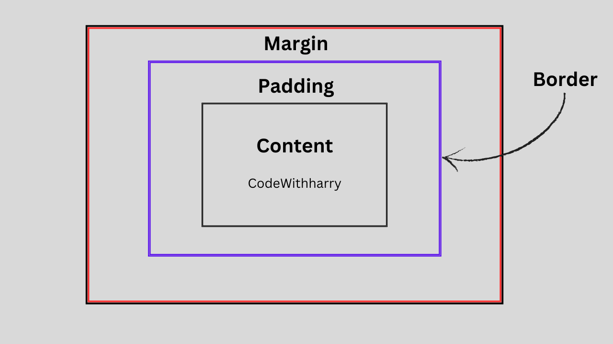

# Sigma Web Development Course

## Tutorial # 17 | CSS Box Model

[](https://www.youtube.com/watch?v=Xrxd6cEajhM&list=PLu0W_9lII9agq5TrH9XLIKQvv0iaF2X3w&index=19)

---

## CSS Box Model

## Components of the Box Model

The box model consists of four components / layers, ordered from the inside out: 

### 1. Content

It is the main content e.g. text, image, video, etc. It is the innermost component of box model. its area is defined by the **width** and **height** properties.

### 2. Padding

Padding is basically the space between the element's content and its border. It is defined by the property **padding**.

### 3. Border

Border surrounds the padding and content of an element. The border properties can be controlled using the **border** keyword.

### 4. Margin

The margin is the outer space between other elements in the layout. In simple words, margin is the gap of one element from other. It can be controlled by the **margin** property. 

---

### Visual Representation

The CSS Box Model can be visualized as:



You can also see the box model of any element in your webpage.

<video src="./box-model.mp4" controls preload muted width="500"></video>

---

## Sizing Models (box-sizing)

The **box-sizing** property determines how the browser calculates an element's total width and height.

### Border Box

Border box keeps the defined width and height intact of the element regardless of padding and border changing. It doesnt expand from the defined width and height.

For example if you set the width and height to **200px** and then gives the padding **10px** and border **10px**, it will be deduct from the content and make it **180px** to make the overall width and height to **200px**

---

## Reset Default Box Model Values

The Browser by default adds different padding and margin to elements. However when we are developing a website, we reset those default values to **0** and give them separately.

#### Why We Do That?

We do that at the start of a project to ensure a consistent and predictable foundation for your layout and fix the box model. 

**Example:**

```css
* {
  margin: 0;
  padding: 0;
  box-sizing: border-box;
}
```

> **Note:** the **`*`** *(universal selector)* selects all elements and reset their value at once. Dont worry because when we give margin & padding below to different the CSS will **override** this because CSS cascades as the name says _Cascading Style Sheet_